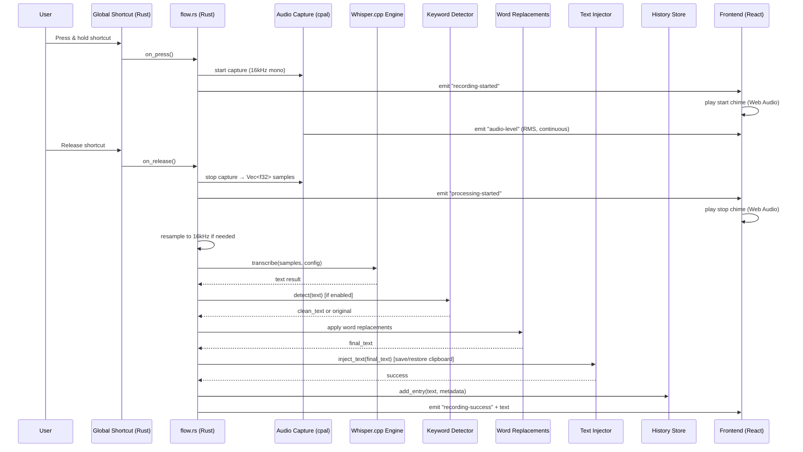

# Design Document: Spext — Offline Speech to Text

## Overview

Spext is a cross-platform desktop speech-to-text application built with Tauri 2.0, targeting macOS, Windows, and Linux. The Rust backend owns the entire hot path — audio capture, transcription, word replacement, and text injection — while the React + TypeScript frontend provides the UI for settings, history, and recording feedback. All transcription runs offline using Whisper.cpp (via whisper-rs). Models are downloaded from HuggingFace and stored locally. Configuration and history are persisted to JSON files in the app data directory.

### Key Design Decisions

- **Tauri 2.0** over Electron: ~4.7MB binary vs ~150MB, system WebView instead of bundled Chromium, Rust backend for performance-critical audio and inference work.
- **Rust owns the hot path**: Audio capture (cpal), Whisper.cpp inference (whisper-rs), word replacement, text injection — all run in Rust. The frontend never touches audio or calls transcription APIs.
- **Whisper.cpp only**: Vosk was removed to reduce complexity and binary size. whisper-rs compiles whisper.cpp from source via cmake — fully self-contained, no external native library needed.
- **Cross-platform text injection**: Platform-specific modules (`injection/macos.rs`, `injection/windows.rs`, `injection/linux.rs`) handle clipboard + paste using OS-native tools. Clipboard is saved before paste and restored after.
- **Hold-to-Talk** via `tauri-plugin-global-shortcut` with press/release state detection.
- **Clipboard + paste** for text injection — the only method that works reliably across all desktop apps including Electron-based ones (VS Code, Slack, Discord).
- **Persistent config and history**: Custom `config_store.rs` and `history_store.rs` modules using simple JSON files — no SQLite or plugin dependencies needed.
- **Minimal plugin footprint**: Only 4 Tauri plugins (global-shortcut, os, process, log), down from 13 in the original design.
- **Zustand** for frontend state management — lightweight, no boilerplate, works well with Tauri's event-driven architecture.
- **Tailwind CSS 4** for styling with a single dark navy theme and teal/cyan accent colors.
- **Web Audio API chimes** for recording start/stop feedback — fresh AudioContext each time to avoid suspension issues.
- **Dark theme only**: Single cohesive dark navy theme, no light mode.

---

## Architecture

The app follows a two-layer architecture: a Rust backend (Tauri) and a TypeScript frontend (React).

```
┌──────────────────────────────────────────────────────────┐
│                   Frontend (React + TypeScript)           │
│  Pages: Home, History, Settings                          │
│  State: Zustand stores (recording, config)               │
│  Events: Tauri event listeners (audio-level, phase, etc) │
│  Audio: Web Audio API chimes (start/stop feedback)       │
├──────────────────────────────────────────────────────────┤
│                   Tauri IPC Bridge                        │
│  Commands: set_config, get_config, get/delete/clear      │
│            history, download/delete model, inject_text    │
│  Events: recording-started, audio-level, recording-*     │
├──────────────────────────────────────────────────────────┤
│                   Backend (Rust)                          │
│  audio/          — cpal microphone capture                │
│  transcription/  — whisper-rs engine                     │
│  models/         — download manager (HuggingFace)        │
│  keywords/       — smart keyword detection               │
│  injection/      — cross-platform clipboard + paste      │
│    ├── macos.rs  — pbcopy/pbpaste + osascript Cmd+V     │
│    ├── windows.rs — PowerShell Set/Get-Clipboard + SendKeys Ctrl+V │
│    └── linux.rs  — xclip/xsel + xdotool Ctrl+V          │
│  hotkey/         — global shortcut registration          │
│  config_store.rs — persistent config (config.json)       │
│  history_store.rs — persistent history (history.json)    │
│  flow.rs         — recording session orchestration       │
│  state.rs        — shared application state              │
│  commands.rs     — Tauri IPC command handlers            │
└──────────────────────────────────────────────────────────┘
```

### Recording Flow (Data Flow)



---

## Components and Interfaces

### Audio Capture (`audio/capture.rs`)

Wraps the `cpal` crate for cross-platform audio input.

```rust
pub struct AudioCapture {
    stream: Option<SendStream>,  // cpal::Stream wrapped for Send safety
    buffer: Arc<Mutex<Vec<f32>>>,
    sample_rate: u32,
}

impl AudioCapture {
    pub fn new() -> Self;
    pub fn start(&mut self, app: AppHandle) -> Result<()>;
    pub fn stop(&mut self) -> (Vec<f32>, u32);
    pub fn list_devices() -> Result<Vec<String>>;
}
```

- `start()` opens the default input device, writes samples to a shared buffer, and emits `audio-level` events with RMS values on each callback.
- `stop()` drops the stream and returns the accumulated samples along with the sample rate.
- `SendStream` wrapper is needed because `cpal::Stream` is not `Send` on macOS (CoreAudio thread affinity). Exclusive `Mutex` access makes this safe.
- Audio is resampled to 16kHz in `flow.rs` if the capture device provides a different rate.

### Transcription Engine (`transcription/engine.rs`)

Dispatches to the Whisper.cpp engine.

```rust
pub fn transcribe(samples: &[f32], config: &SpextConfig) -> Result<String>;
```

Routes to `transcription::whisper::transcribe()` using the configured model and language.

### Whisper.cpp Engine (`transcription/whisper.rs`)

Wraps `whisper-rs` for local Whisper inference.

```rust
pub fn transcribe(samples: &[f32], model: &WhisperModel, language: &str) -> Result<String>;
```

- Loads the GGML model file from the local models directory.
- Creates a `WhisperContext` and `WhisperState`.
- Configures `FullParams` with greedy sampling, 4 threads, no timestamps, suppress blanks.
- Runs `state.full(params, samples)` and concatenates all segment texts.

### Model Manager (`models/manager.rs`)

Handles model lifecycle: download, storage, listing, deletion.

```rust
pub fn models_dir() -> Result<PathBuf>;
pub fn whisper_model_path(model: &WhisperModel) -> Result<PathBuf>;
pub fn is_whisper_downloaded(model: &WhisperModel) -> bool;
pub fn list_whisper_models() -> Vec<ModelInfo>;
pub async fn download_whisper_model(app: &AppHandle, model: &WhisperModel) -> Result<PathBuf>;
pub fn delete_whisper_model(model: &WhisperModel) -> Result<()>;
```

- Models stored in `{app_data_dir}/models/whisper/`.
- Downloads use `reqwest` with streaming and emit `model-download-progress` events.

### Config Store (`config_store.rs`)

Persists application configuration to a JSON file.

```rust
pub fn load_config() -> SpextConfig;
pub fn save_config(config: &SpextConfig) -> Result<()>;
```

- Config file path: `{data_dir}/com.gulshanyadav.spext/config.json`.
- `load_config()` returns default config if file doesn't exist or is invalid.
- `save_config()` writes pretty-printed JSON to disk.
- Called on startup (load) and on every `set_config` command (save).

### History Store (`history_store.rs`)

Persists transcription history to a JSON file.

```rust
pub struct HistoryEntry {
    pub id: String,
    pub text: String,
    pub original_text: String,
    pub language: String,
    pub timestamp: String,
    pub duration_secs: f32,
}

pub struct HistoryData {
    pub entries: Vec<HistoryEntry>,
}

pub fn load_history() -> HistoryData;
pub fn save_history(data: &HistoryData) -> Result<()>;
pub fn add_entry(entry: HistoryEntry) -> Result<()>;
pub fn delete_entry(id: &str) -> Result<()>;
pub fn clear_all() -> Result<()>;
```

- History file path: `{data_dir}/com.gulshanyadav.spext/history.json`.
- Entries stored newest-first.
- Supports add, delete individual, and clear all operations.

### Keyword Detector (`keywords/detector.rs`)

Scans transcribed text for trigger phrases.

```rust
pub fn detect(text: &str) -> Option<KeywordMatch>;

pub struct KeywordMatch {
    pub action: String,
    pub format: Option<String>,
    pub clean_text: String,
}
```

- Matches trigger verbs case-insensitively, longest-first (greedy).
- Strips the trigger phrase and optional format target from the text.
- Returns `None` if no trigger is found.

### Text Injector (`injection/mod.rs` + platform modules)

Cross-platform text injection with clipboard preservation.

```rust
// injection/mod.rs — dispatches to platform module
pub async fn inject_text(text: &str) -> Result<()>;
pub fn check_accessibility_permission() -> bool;
pub fn open_accessibility_settings() -> Result<()>;
```

Platform implementations:

| Platform | Clipboard Read | Clipboard Write | Paste Simulation |
|----------|---------------|-----------------|------------------|
| macOS | `pbpaste` | `pbcopy` | `osascript` System Events `Cmd+V` |
| Windows | PowerShell `Get-Clipboard` | PowerShell `Set-Clipboard` | PowerShell `SendKeys` `Ctrl+V` |
| Linux | `xclip -o` / `xsel -o` | `xclip` / `xsel` | `xdotool key ctrl+v` |

All platforms follow the same flow:
1. Save current clipboard contents
2. Wait 100ms for pending key events to settle
3. Set clipboard to transcribed text
4. Simulate paste keystroke
5. Wait 150ms for paste to complete
6. Restore original clipboard contents

### Global Shortcut Handler (`hotkey/handler.rs`)

Registers and manages the hold-to-talk shortcut.

```rust
pub fn register_hotkey(app: &AppHandle, shortcut_str: &str) -> Result<()>;
pub fn unregister_all(app: &AppHandle) -> Result<()>;
```

- Uses `tauri-plugin-global-shortcut` with `ShortcutState::Pressed` and `ShortcutState::Released` events.
- Spawns async tasks for `flow::on_press` and `flow::on_release`.

### Recording Flow (`flow.rs`)

Orchestrates the full recording session lifecycle.

```rust
pub async fn on_press(app: AppHandle, state: AppState);
pub async fn on_release(app: AppHandle, state: AppState);
```

- `on_press`: Guards against non-Idle state, sets phase to Recording, starts audio capture, emits events.
- `on_release`: Waits for capture readiness, sets phase to Processing, stops capture, resamples to 16kHz if needed, runs transcription in `spawn_blocking`, detects keywords (if enabled), applies word replacements (case-insensitive), injects text (with clipboard preservation), saves to history store, emits success/error events.

---

## Data Models

### SpextConfig (`state.rs`)

```rust
pub struct SpextConfig {
    pub shortcut: String,                // default: "Alt+Space"
    pub language: String,                // default: "en"
    pub whisper_model: WhisperModel,     // default: Base
    pub smart_keywords_enabled: bool,    // default: false
    pub copy_to_clipboard: bool,         // default: true
    pub replacements: Vec<WordReplacement>, // default: []
}
```

### WordReplacement (`state.rs`)

```rust
pub struct WordReplacement {
    pub from: String,
    pub to: String,
}
```

### WhisperModel (`state.rs`)

Enum with 10 variants (Tiny, TinyEn, Base, BaseEn, Small, SmallEn, Medium, MediumEn, LargeV3, LargeV3Turbo). Each variant provides:
- `download_url()` → HuggingFace URL
- `filename()` → local filename
- `display_name()` → human-readable name with size

### ModelInfo (`state.rs`)

```rust
pub struct ModelInfo {
    pub id: String,
    pub name: String,
    pub engine: String,
    pub size_display: String,
    pub downloaded: bool,
    pub path: Option<String>,
}
```

### RecordingPhase (`state.rs`)

```rust
pub enum RecordingPhase { Idle, Recording, Processing, Success, Error }
```

### AppState (`state.rs`)

```rust
pub struct AppState {
    pub recording_phase: Arc<Mutex<RecordingPhase>>,
    pub config: Arc<Mutex<SpextConfig>>,
    pub audio_capture: Arc<std::sync::Mutex<AudioCapture>>,
}
```

- `recording_phase` uses tokio `Mutex` for async access.
- `config` uses tokio `Mutex` for async access.
- `audio_capture` uses `std::sync::Mutex` because cpal callbacks run on OS audio threads and need synchronous access.

---

## Frontend Architecture

### State Management (Zustand)

Two stores:
- **useRecordingStore**: phase, audioLevel, durationSecs, error, lastTranscription
- **useConfigStore**: config object, loadConfig(), updateConfig()

### Event Bridge (useRecordingFlow hook)

A single hook mounted at the app root listens to all Rust events:
- `recording-started` → phase = "recording", play start chime, start duration counter
- `audio-level` → update audioLevel
- `processing-started` → phase = "processing", play stop chime
- `recording-success` → phase = "success", auto-reset after 5s
- `recording-error` → phase = "error", auto-reset after 3s

### Audio Chime (useRecordingChime)

Synthesized audio feedback using Web Audio API:
- `playStartChime()`: Ascending dual-oscillator tone (520Hz→420Hz + 780Hz harmonic)
- `playStopChime()`: Descending single-oscillator tone (380Hz→280Hz)
- Fresh `AudioContext` created each time to avoid browser suspension issues
- Context closed after 500ms to free resources

### Pages

- **HomePage**: Gradient mic orb (110px) with pulse animations, ambient floating background orbs, canvas-based waveform visualizer, glass-morphism feature pills (Hold to Talk, Offline, 100+ Languages), test output textarea for capturing injected text
- **HistoryPage**: Persistent card-based entries with gradient borders, search input, relative timestamps, copy/delete per entry, clear all with confirmation
- **SettingsPage**: Gradient-border card sections for Shortcut (dropdown selector), Models (grid layout), Language, Word Replacements (editor), Smart Keywords (animated toggle), Permissions

### Components

- **Layout**: 72px sidebar with icon + text label navigation, active indicator bar with gradient, page transitions via Framer Motion AnimatePresence
- **ShortcutSelector**: Dropdown-based (modifier dropdown + key dropdown), OS-aware (macOS symbols vs standard labels)
- **LiveWaveform**: Canvas-based real-time waveform driven by audio-level events
- **ReplacementEditor**: Dynamic list of from/to input pairs with add/remove

### Frontend Dependencies

```json
{
  "dependencies": {
    "@tailwindcss/vite": "^4.2.4",
    "@tauri-apps/api": "^2",
    "@tauri-apps/plugin-os": "^2.3.2",
    "framer-motion": "^11.18.2",
    "lucide-react": "^0.468.0",
    "react": "^19.1.0",
    "react-dom": "^19.1.0",
    "react-router-dom": "^6.30.3",
    "tailwindcss": "^4.2.4",
    "zod": "^3.25.76",
    "zustand": "^5.0.12"
  }
}
```

---

## Tauri IPC Commands

| Command | Direction | Description |
|---------|-----------|-------------|
| `get_config` | Frontend → Rust | Returns current SpextConfig |
| `set_config` | Frontend → Rust | Updates config, persists to disk, re-registers shortcut if changed |
| `get_recording_phase` | Frontend → Rust | Returns current phase as string |
| `list_audio_devices` | Frontend → Rust | Returns list of input device names |
| `check_accessibility` | Frontend → Rust | Returns boolean (always true on Windows/Linux) |
| `open_accessibility_settings` | Frontend → Rust | Opens macOS System Preferences (no-op on other platforms) |
| `list_whisper_models` | Frontend → Rust | Returns Vec<ModelInfo> |
| `download_whisper_model` | Frontend → Rust | Downloads model, emits progress events |
| `delete_whisper_model_cmd` | Frontend → Rust | Deletes model file |
| `detect_keywords` | Frontend → Rust | Returns Optional<KeywordMatch> |
| `inject_text` | Frontend → Rust | Injects text via clipboard + paste |
| `get_history` | Frontend → Rust | Returns Vec<HistoryEntry> from history.json |
| `add_history_entry` | Frontend → Rust | Adds entry to history.json |
| `delete_history_entry` | Frontend → Rust | Deletes single entry by ID |
| `clear_history` | Frontend → Rust | Clears all history entries |

## Tauri Events (Rust → Frontend)

| Event | Payload | Description |
|-------|---------|-------------|
| `recording-started` | `()` | Recording has begun |
| `audio-level` | `f32` | RMS audio level for waveform |
| `processing-started` | `()` | Transcription in progress |
| `processing-ai` | `String` | Smart keyword action detected |
| `recording-success` | `String` | Final transcribed text |
| `recording-error` | `String` | Error message |
| `save-history` | `JSON` | History entry metadata (triggers UI refresh) |
| `model-download-progress` | `JSON` | Download progress with model_id, progress, status |
| `navigate` | `String` | Navigation request from tray menu |

## Tauri Plugins (4 total)

| Plugin | Purpose |
|--------|---------|
| `tauri-plugin-global-shortcut` | System-wide hold-to-talk shortcut with press/release detection |
| `tauri-plugin-os` | Platform detection for OS-aware UI (macOS symbols, etc.) |
| `tauri-plugin-process` | App exit/restart control |
| `tauri-plugin-log` | Structured logging |

## Rust Dependencies

```toml
[dependencies]
tauri = { version = "2", features = ["macos-private-api", "tray-icon"] }
tauri-plugin-global-shortcut = "2"
tauri-plugin-os = "2"
tauri-plugin-process = "2"
tauri-plugin-log = "2"
serde = { version = "1", features = ["derive"] }
serde_json = "1"
anyhow = "1"
tokio = { version = "1", features = ["rt-multi-thread", "macros", "time", "sync"] }
cpal = "0.15"
whisper-rs = "0.14"
reqwest = { version = "0.12", features = ["json", "stream"] }
futures-util = "0.3"
log = "0.4"
chrono = { version = "0.4", features = ["serde"] }
dirs = "6"
```

---

## Error Handling

| Scenario | Component | Handling |
|----------|-----------|---------|
| No microphone available | AudioCapture | Return error → emit `recording-error` → phase = Error |
| Model not downloaded | Transcription Engine | Return error with download instructions → emit `recording-error` |
| Whisper inference failure | whisper.rs | Return descriptive error → emit `recording-error` |
| Accessibility not granted (macOS) | Text Injector | Return error → emit `recording-error` |
| Shortcut registration conflict | Hotkey Handler | Log error, return error to frontend |
| Model download network failure | Model Manager | Return error, clean up partial file |
| Empty transcription result | Flow | Emit `recording-error` with "No speech detected" |
| Recording too short (<0.3s) | Flow | Emit `recording-error` with "Recording too short" |
| Config file corrupt | Config Store | Log warning, use default config |
| History file corrupt | History Store | Log warning, use empty history |
| Clipboard tool not found (Linux) | Text Injector | Return error with install instructions |
| Audio lock contention | Flow | Return error, reset to Idle |

---

## Testing Strategy

### Unit Tests (Rust)

- **Keyword Detector**: trigger phrase detection, clean text extraction, no-match returns None, case insensitivity, longest-match-first behavior.
- **Model Manager**: path construction, download status checks, model listing.
- **State**: config serialization/deserialization, model enum URL/filename correctness.
- **Config Store**: load/save round-trip, default on missing file.
- **History Store**: add/delete/clear operations, load on missing file.

### Integration Tests

- **Audio → Transcription pipeline**: capture mock audio, run through Whisper.cpp with a tiny model, verify non-empty text output.
- **Model download**: download the smallest model (tiny), verify file exists and is valid.
- **Text injection**: inject known text, verify clipboard contents.
- **Word replacements**: verify case-insensitive replacement in transcription flow.

### Frontend Tests

- **TypeScript type checking**: `tsc --noEmit` passes with zero errors.
- **Vite build**: production build completes without errors.
- **Component rendering**: Settings page renders all sections, model grid displays correctly.

### CI/CD

- **GitHub Actions**: Build workflow for macOS (arm64, x64), Windows (x64), Linux (x64).
- Installs platform-specific dependencies (cmake, libasound2-dev, libwebkit2gtk, etc.).
- Produces `.dmg`, `.msi`, `.deb`, `.AppImage` artifacts.

---

## Security Considerations

- API keys are not used or stored — the app is fully offline.
- Audio data is never transmitted over the network.
- Model downloads use HTTPS from trusted sources (HuggingFace).
- The clipboard is used transiently for text injection; original contents are saved and restored after paste.
- Accessibility permission is the only elevated permission required (macOS only).
- macOS Info.plist includes `NSMicrophoneUsageDescription` and `NSAppleEventsUsageDescription`.

---

## macOS Permissions

The following entries are included in `Info.plist`:

```xml
<key>NSMicrophoneUsageDescription</key>
<string>Spext needs microphone access to transcribe your speech to text.</string>
<key>NSAppleEventsUsageDescription</key>
<string>Spext needs automation access to paste transcribed text into other applications.</string>
```
